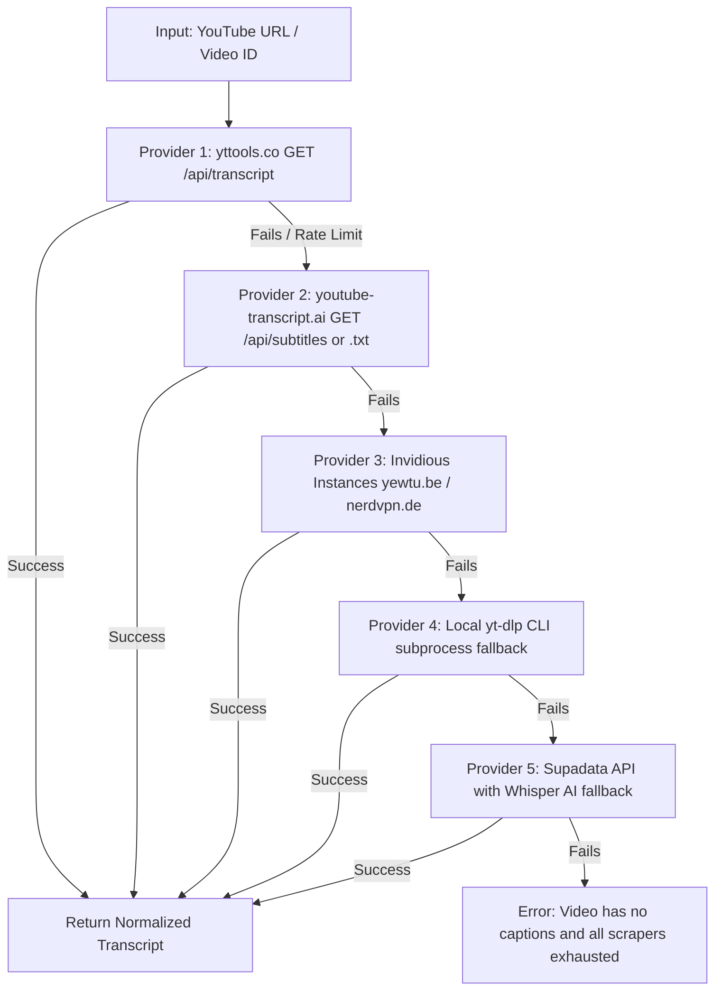

# Comprehensive Handover & Research Summary: YouTube Transcript / Caption APIs

## 1. Goal & User Instructions Overview

The objective is to discover and reverse-engineer third-party web services and API endpoints that extract YouTube transcripts/captions programmatically:
- Find services operating online that provide YouTube captions/transcripts.
- Target Next.js / modern web apps that expose hidden `/api/...` endpoints (e.g., `/api/transcript`, `/api/subtitles`, `/api/captions`).
- Test user-suggested routes & platforms:
  - `yttools.co`
  - `youtube-transcript.ai`
  - `youtube-transcript.io`
  - Invidious & Piped public instances
  - `downsub.com`
  - Official YouTube `timedtext` API (`/api/timedtext?v=...&fmt=json3|srv3|vtt`)
- Verify all endpoints live via CLI (`curl.exe`, PowerShell `Invoke-RestMethod`).
- Document verified endpoints, payloads, auth requirements, failure causes, and architectural fallback chains so any subsequent AI agent can immediately build or integrate them.

---

## 2. Core Technical Findings: How These Services Work Under the Hood

### The Underlying Mechanism
Nearly all scraping services tap into YouTube's internal **Innertube / player** architecture:
1. **Metadata & Caption Discovery**: A client queries `https://www.youtube.com/youtubei/v1/player` (or extracts `ytInitialPlayerResponse` from `https://www.youtube.com/watch?v={videoId}`).
2. **Caption Track Extraction**: The response contains `playerCaptionsTracklistRenderer.captionTracks[]` with a `baseUrl` pointing to `https://www.youtube.com/api/timedtext?...`.
3. **TimedText Retrieval**:
   - Querying `baseUrl` returns TimedText XML or WebVTT.
   - Appending `&fmt=json3` converts the output to JSON format natively on YouTube's servers.
4. **Why Direct Scraping Breaks (2024–2026 Guardrails)**:
   - YouTube now appends cryptographic signing params (`signature`, `sparams`, `expire`, `key=yt8`) and enforces **Proof of Origin (`poToken`)** and bot checks on datacenter IPs.
   - Calling `/api/timedtext` directly without valid session tokens or from flagged IPs frequently returns `HTTP 200` with **`Content-Length: 0`** or `403 Forbidden`.
   - **Third-party services solve this** by managing residential proxy pools, token rotation, or Whisper-based AI fallbacks.

---

## 3. Verified Working APIs (Live Tested & Ready to Use)

### 🥇 1. `yttools.co` — Undocumented Next.js GET API
- **Endpoint**: `GET https://yttools.co/api/transcript`
- **Auth**: None
- **Rate Limit**: Uncapped / High
- **Format**: JSON (`transcript` array with `text`, `duration`, `offset`, `lang`)
- **Query Parameters**:
  - `url`: Full YouTube URL (e.g., `https://www.youtube.com/watch?v=dQw4w9WgXcQ`)
  - `lang`: Optional language code (e.g., `es`, `de`)
- **Test Command**:
  ```powershell
  curl.exe -s "https://yttools.co/api/transcript?url=https://www.youtube.com/watch?v=dQw4w9WgXcQ"
  ```
- **Response Sample**:
  ```json
  {
    "transcript": [
      {
        "text": "♪ Never gonna give you up ♪",
        "duration": 2120,
        "offset": 43000,
        "lang": "en"
      }
    ],
    "videoId": "dQw4w9WgXcQ"
  }
  ```

---

### 🥈 2. `youtube-transcript.ai` — Dual Zero-Auth Endpoints

#### A. Structured JSON + WebVTT Endpoint
- **Endpoint**: `GET https://youtube-transcript.ai/api/subtitles?v={videoId}`
- **Auth**: None
- **Format**: JSON containing video metadata (`title`, `author`, `durationSec`, `viewCount`), raw `vttContent`, and direct `vttUrl` / `json3Url` links.
- **Test Command**:
  ```powershell
  curl.exe -s "https://youtube-transcript.ai/api/subtitles?v=dQw4w9WgXcQ"
  ```

#### B. Clean Markdown / Plain-Text Endpoint
- **Endpoint**: `GET https://youtube-transcript.ai/transcript/{videoId}.txt`
- **Auth**: None
- **Query Parameters**: `?lang={langCode}` (e.g., `?lang=es-419`, `?lang=de-DE`)
- **Format**: Clean timestamped Markdown `[m:ss]`
- **Test Command**:
  ```powershell
  curl.exe -s "https://youtube-transcript.ai/transcript/dQw4w9WgXcQ.txt"
  ```

---

### 🥉 3. Public Invidious Instances
- **Endpoints**:
  - Track List: `GET https://{instance}/api/v1/captions/{videoId}`
  - WebVTT Subtitles: `GET https://{instance}/api/v1/captions/{videoId}?lang={lang}`
- **Verified Working Instances**:
  - `https://yewtu.be`
  - `https://invidious.nerdvpn.de`
  - `https://invidious.projectsegfau.lt`
- **Test Command**:
  ```powershell
  curl.exe -s "https://invidious.nerdvpn.de/api/v1/captions/dQw4w9WgXcQ?lang=en"
  ```

---

### 4. `yttranscript.ai` — Next.js POST API (Limited)
- **Endpoint**: `POST https://yttranscript.ai/api/transcript`
- **Auth**: None
- **Payload**: `{"videoId": "dQw4w9WgXcQ"}`
- **Quota**: **3 free requests/month** (tracked in response payload)
- **Format**: JSON with `transcript[]`, `fullText`, and `videoTitle`
- **Test Command**:
  ```powershell
  $body = '{"videoId":"dQw4w9WgXcQ"}'
  Invoke-RestMethod -Uri "https://yttranscript.ai/api/transcript" -Method POST -ContentType "application/json" -Body $body
  ```

---

### 5. `supadata.ai` — Documented Developer API
- **Endpoint**: `GET https://api.supadata.ai/v1/youtube/transcript?url={url}`
- **Auth**: Header `x-api-key: <KEY>`
- **Quota**: 100 free requests/month (no credit card needed)
- **Key Advantage**: Automatically runs Whisper AI transcription if the video has no native captions.

---

## 4. Tested Services That Failed or Require Auth / Browser

| Service | Endpoint Tested | Status | Reason / Blocker |
| :--- | :--- | :--- | :--- |
| **`youtube-transcript.io`** | `POST /api/transcripts` | `401 Unauthorized` | Requires Basic Auth token (`Authorization: Basic ...`). Payload requires `{"ids": ["..."]}`. |
| **`ytranscript.com`** | `/api/transcript` | `403 Forbidden` | Protected by Cloudflare Turnstile bot detection (`"turnstile_failed": true`). |
| **`downsub.com`** | `/?url=...` | `200 OK` (HTML) | Client-side Vue.js SPA; no direct public REST endpoint for raw transcript data. |
| **`tubealfred.com`** | `/api/transcript` | `404 Not Found` | Bot-protected web interface without headless browser context. |
| **`notegpt.io`** | `/api/...` | `404 / 401` | Session-authenticated, credit-metered endpoints. |
| **`kome.ai`** | `/api/...` | `404 Not Found` | Requires internal CSRF & session tokens from active browser session. |
| **Official YouTube TimedText** | `youtube.com/api/timedtext?v=...` | `200` empty / `403` | Fails on datacenter IPs / raw HTTP without `signature` + `poToken`. |

---

## 5. Recommended Fallback Architecture for Downstream Agents

Any AI agent integrating transcript fetching should implement this layered waterfall:



### Reference Implementation Snippet (TypeScript)
```typescript
export interface TranscriptItem {
  text: string;
  offset: number; // milliseconds
  duration: number; // milliseconds
}

export async function fetchYouTubeTranscript(videoId: string, lang = 'en'): Promise<TranscriptItem[]> {
  // 1. Primary: yttools.co
  try {
    const res = await fetch(`https://yttools.co/api/transcript?url=https://www.youtube.com/watch?v=${videoId}&lang=${lang}`);
    if (res.ok) {
      const data = await res.json();
      if (Array.isArray(data.transcript)) return data.transcript;
    }
  } catch {}

  // 2. Secondary: youtube-transcript.ai (JSON API)
  try {
    const res = await fetch(`https://youtube-transcript.ai/api/subtitles?v=${videoId}`);
    if (res.ok) {
      const data = await res.json();
      const track = data.subtitles?.find((s: any) => s.langCode === lang) || data.subtitles?.[0];
      if (track?.vttContent) {
        return parseVTT(track.vttContent);
      }
    }
  } catch {}

  // 3. Tertiary: Invidious instance
  const instances = ['https://yewtu.be', 'https://invidious.nerdvpn.de'];
  for (const instance of instances) {
    try {
      const res = await fetch(`${instance}/api/v1/captions/${videoId}?lang=${lang}`);
      if (res.ok) {
        const vtt = await res.text();
        return parseVTT(vtt);
      }
    } catch {}
  }

  throw new Error(`Unable to extract transcript for video: ${videoId}`);
}
```

---

## 6. Actionable Next Steps for Next Agent
1. **Integrate into `youtube-cli`**: Create a dedicated module `src/transcript/` using the fallback chain above.
2. **Parser Utility**: Add a fast WebVTT / TimedText parser to normalize output from `youtube-transcript.ai` and Invidious into a standard JSON schema.
3. **Local CLI Fallback**: When network scrapers fail, invoke local `yt-dlp` (`yt-dlp --skip-download --write-auto-subs --sub-lang en --output ...`).
